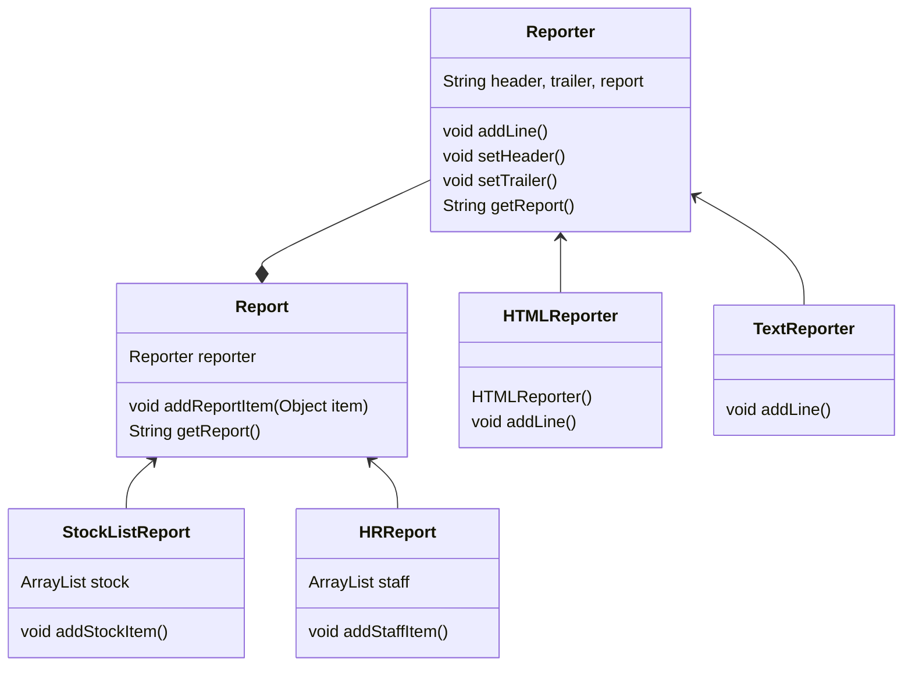
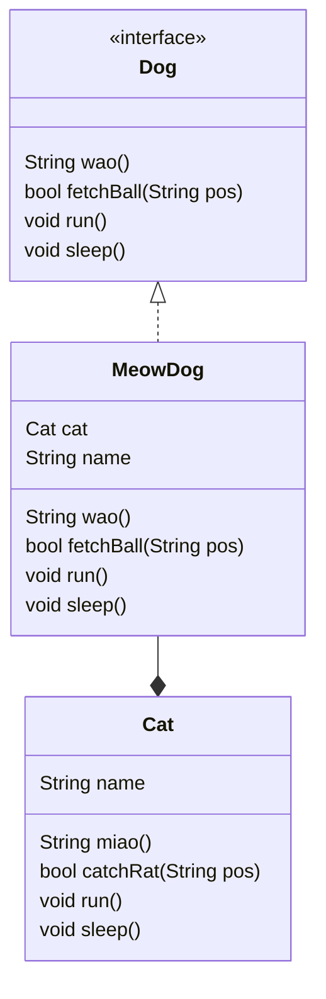
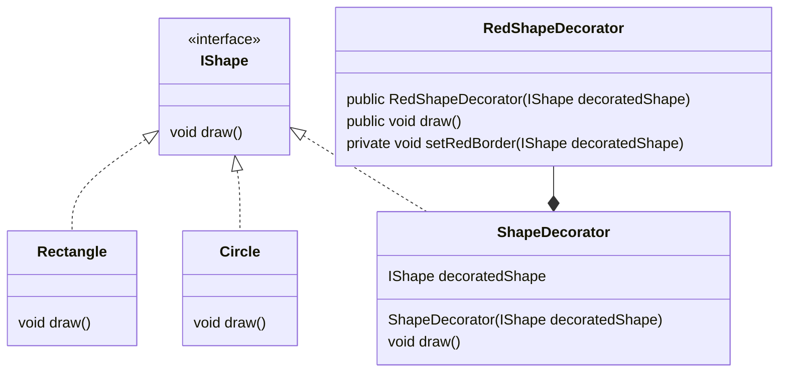

# 桥接模式



## Input Sample

```java
public class ReportClient {
	public static void main(String[] args) {
		HRReport hrReport = new HRReport(new HTMLReporter());
		hrReport.addStaffItem(new StaffItem("Bob", "Development"));
		System.out.println(hrReport.getReport());
		
		StockListReport stockReport = new StockListReport(new TextReporter());
		stockReport.addStockItem(new StockItem("Milk", "Drink", 10));
		stockReport.addStockItem(new StockItem("Bread", "Food", 20));
		System.out.println(stockReport.getReport());
	}
}
```

## Output

```
<html>
<head></head>
<body>
Name: Bob Department: Development<br>
</body>
</html>
Name: Milk Type: Drink Count: 10
Name: Bread Type: Food Count: 20
```

# 适配器模式

## 课堂练习

现有一个 Cat 具体类，并实现了 miao()、catchRat()、run()、sleep() 等方法。另外有一个 Dog 接口，要求有 wao()、fetchBall()、run()、sleep() 等方法。假设你的朋友想要一只 Dog，但是你只找到了一只 Cat，你怎样做才能用那只该死的 Cat 让你的朋友满意？ 
请用适配器模式来解决以上问题，并用 UML 图示意。



```java
public class MeowDog implements Dog{
	Cat cat;
	String name;
	
	public String wao() {	// 返回 meow XD
		return cat.miao();
	}

	public bool fetchBall(String pos) {	// 有没有抓到
		return cat.catchRat(pos);
	}

	public void run() {
		cat.run();
	}

	public void sleep() {
		cat.sleep();
	}
}
```

# 装饰模式



## Output

```
无边框的Circle：
我是Circle！

带红色边框的Circle：
我是Circle！
我有红边框！

带红色边框的Rectangle：
我是Rectangle！
我有红边框！
```