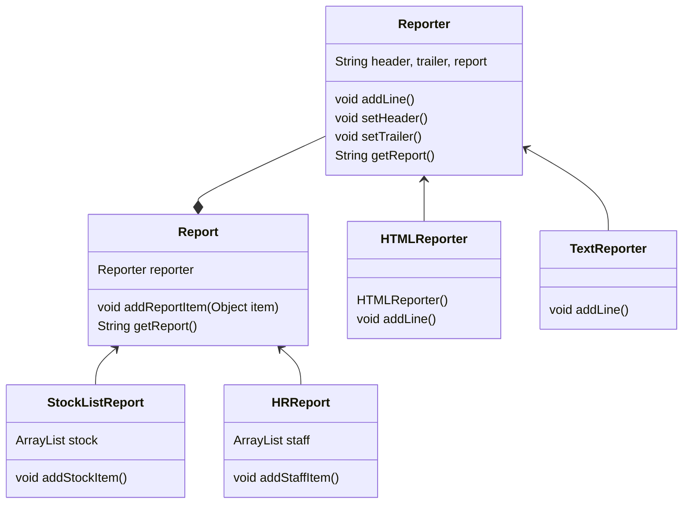

# 桥接模式



## Input Sample

```java
public class ReportClient {
	public static void main(String[] args) {
		HRReport hrReport = new HRReport(new HTMLReporter());
		hrReport.addStaffItem(new StaffItem("Bob", "Development"));
		System.out.println(hrReport.getReport());
		
		StockListReport stockReport = new StockListReport(new TextReporter());
		stockReport.addStockItem(new StockItem("Milk", "Drink", 10));
		stockReport.addStockItem(new StockItem("Bread", "Food", 20));
		System.out.println(stockReport.getReport());
	}
}
```

## Output

```
<html>
<head></head>
<body>
Name: Bob Department: Development<br>
</body>
</html>
Name: Milk Type: Drink Count: 10
Name: Bread Type: Food Count: 20
```