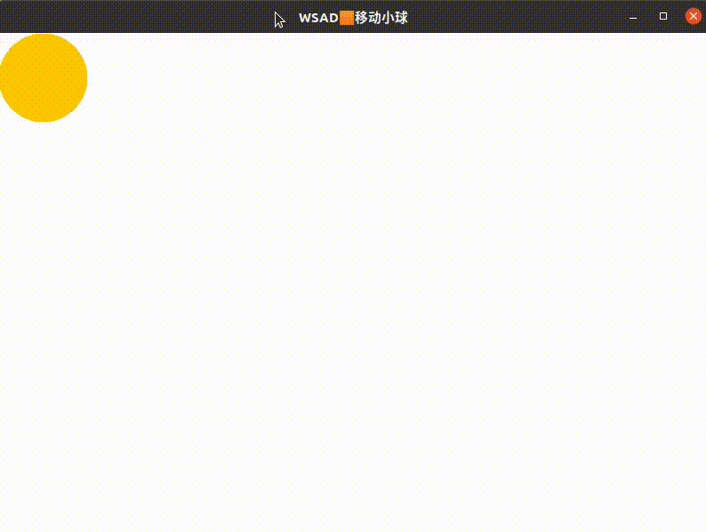
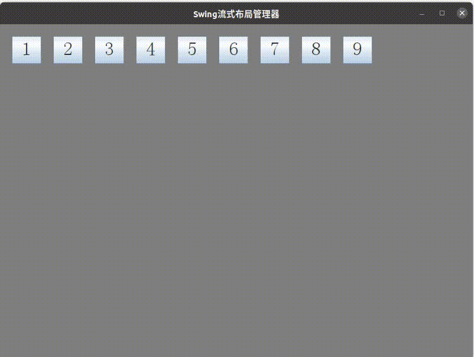
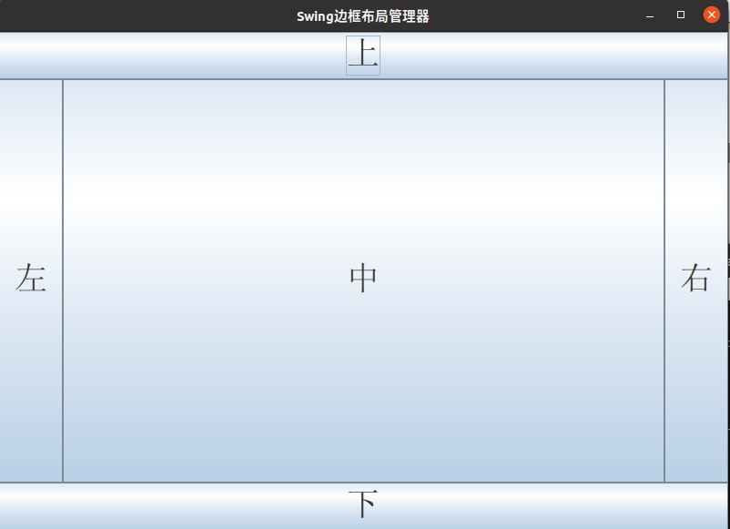

# GUI 框架

## Swing 动画

将原先自动变更小球位置的「动画」形式，修改为根据用户输入变更小球位置。

```java
// 不依赖用户输入变更小球位置
while(true) {
    // 不停的重绘JPanel,实现动画的效果
    panel.animate();
    try
    {
        Thread.sleep(40);
    }
    catch (InterruptedException e)
    {
        e.printStackTrace();
    }
}
```



## FlowLayout 流式布局管理器

按钮在容器内按照从上到下、从左到右的顺序排列，如果一行剩余空间不足容纳组件将换行显示。



## BorderLayout 边框布局管理器

- 将窗口分为东南西北中五个区域，不要求所有区域都必须有组件
  - 若四周区域没有组件，则由 Center 区域填充
- 区域内只显示最后添加的组件

