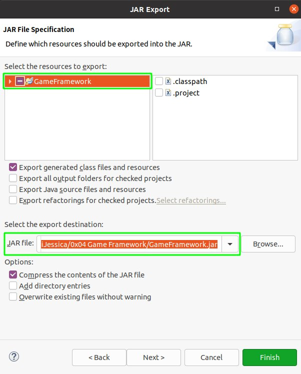
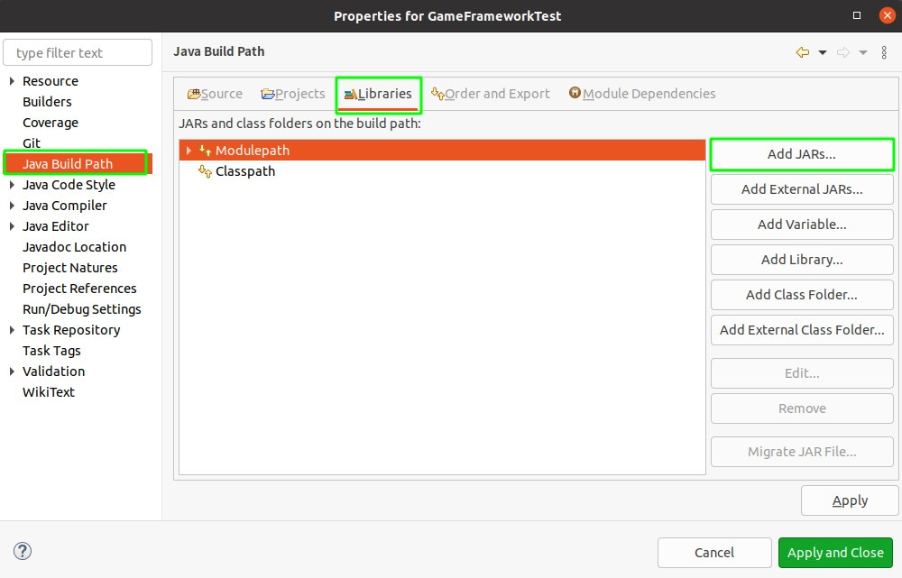
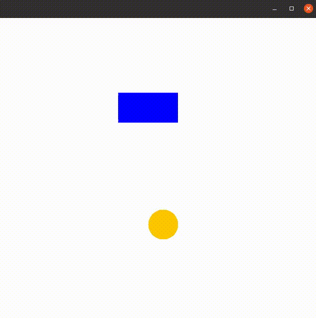

# Game Framework

## 游戏框架打包

- 在 `File -> Export` 选择导出 `JAR file`
- 选择导出工程及导出目录、JAR 包文件名 

## 基于框架的游戏开发

- 将 JAR 包置于工程根目录下
- `Refresh` 工程目录
- 在 `Project -> Properties` 选择 `Java Build Path`，在 `Add JARs` 选择之前导出的 JAR 包 

### Game Framework Test

