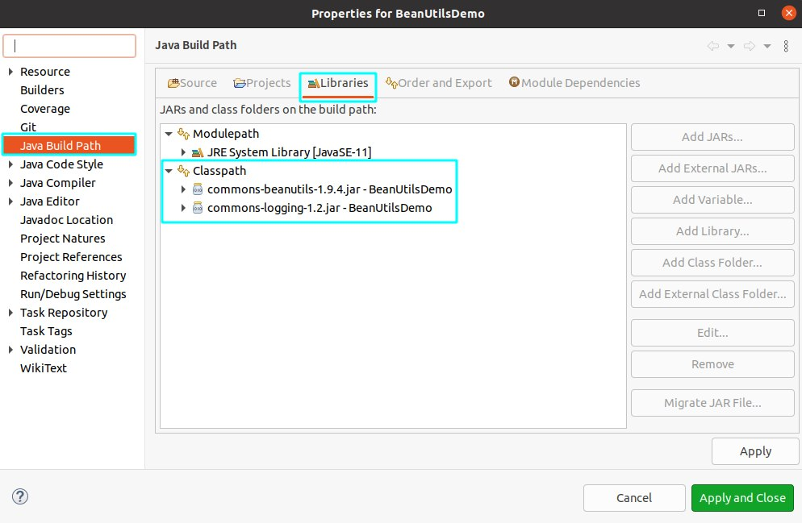

# 基于组件的软件开发

## BeanUtilsDemo

### Install

- 下载 [BeanUtils](https://commons.apache.org/proper/commons-beanutils/download_beanutils.cgi) 以及 [Logging](https://commons.apache.org/proper/commons-logging/download_logging.cgi)（BeanUtils 对其有依赖） 的压缩包
- 解压后将 `commons-beanutils-1.9.4.jar` 和 `commons-logging-1.2.jar` 导入工程，注意要放在 `Classpath` 下<br>


### Output

```
Employee@2f410acf
Id	Name	Salary	Birthday
101	Alice	1000.0	Thu Dec 07 00:00:00 CST 2000
```